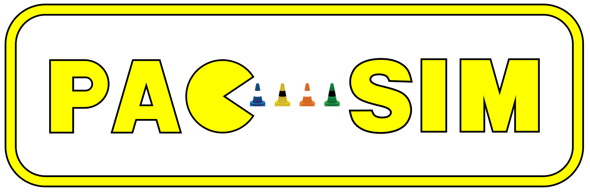

# PacSim
PacSim (Planning and Controls Simuluator) is a simulator for Formula Student Driverless competitions originally developed at [Elbflorace](https://elbflorace.de/).

Example of a pipeline running in PacSim running with visualizations in Foxglove:

# Features
* Closed loop simulation of the autonomous system.
  * Simulation of vehicle dynamics
  * Simulation of all the relevant sensors (except for raw perception data) for autonomous operation. All sensors simulated are specified by at least their rate, dead time (delay), noise and some sensor-specific additional attributes.
    * IMU, wheel speeds, wheel motor torques, steering angle, GNSS
    * Mock model of the detected cones by the perception system
  * Competition logic
    * Track lap times, evaluate penalties and detect DNF
    * Create report at the end of the run
  * Configurable grip map (different friction coefficients for track segments)
* Additional scripts and tools
  * Track editor (track_editor directory)
  * Converter from [FSSIM](https://github.com/AMZ-Driverless/fssim) sdf to our track format.

# Prerequisites
This package is developed and tested on Ubuntu 22.04 with ROS2 Iron. 

Install dependencies:

`sudo apt install ros-iron-desktop ros-iron-xacro`

# How to get started
To use PacSim with your autonomous system, you need to create a message converter node to match your own interfaces with the simulator.

We provide an example launch file (example.launch.py) which shows an example of how to start the simulator node and the robot_state_publisher for the 3d visualization of the car.

The sensors and vehicle model are configured using config files. Examples are provided in the config folder. Things such as the discipline or the path of the track file or config files are defined using ros2 parameters.

The default vehicle model provided is rather simple and just meant to be a starting point. You are encouraged to integrate your own vehicle model by implementing the `IVehicleModel` class 

# Contributing
Contributions in any form (reports, feedback, requests, submissions) are welcome. Preferably create an Issue or Pull request for that.

The project also has a [discord server](https://discord.gg/Ay3XzB5p33).

# Known issues
* In Foxglove Studio (in contrast to RViz) the mesh of the car is displayed incorrectly using default settings. To fix this go to the left sidebar of the 3d panel -> Scene -> Mesh up axis and select Z-up. Restart to apply the change.
* Currently the track editor can't handle the skidpad and acceleration tracks (lanesFirstWithLastConnected = False) properly.
* Currently there exists no editor and visualization for the grip map.

# Acknowledgements
The initial version was developed at Elbflorace by:
* Alexander Phieler (Main development)
* Niklas Leukroth (Track and Config file parser)
* Sergio Antuna (Artwork)
* Tim Hanel (3d car model integration)